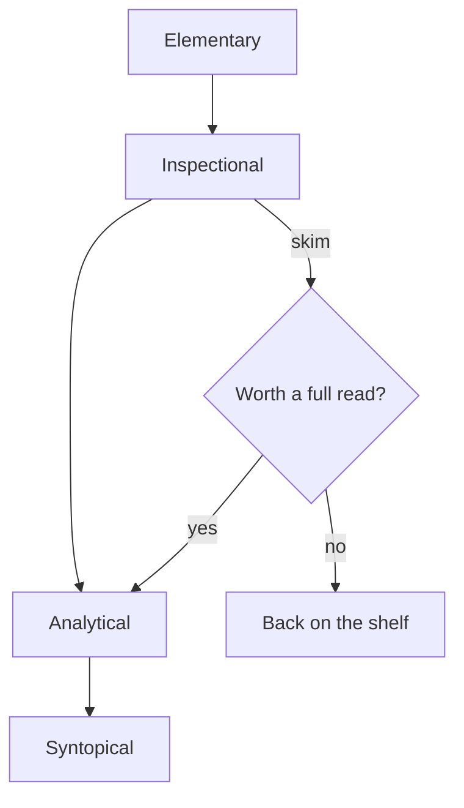

title:: Test
date:: 2021-08-04


[[zombie]]

: test :: 1, true, string

This is a page is for testing and showcasing the markdown styles in this template.

## Markdown

(some escape chars `\` are added to ensure raw display)

### WikiRefs

#### A Prefixed WikiAttr

```markdown
:prefixed-wikiattr::[[wikirefs]]
```

:prefixed-wikiattr::[[wikirefs]]

(see attrbox for output)

#### A Prefixed WikiAttr List

```markdown
: prefixed-wikiattr-list :: 
- [[bk.how-to-read-a-book]]
- [[feedback]]
```

: prefixed-wikiattr-list :: 
- [[bk.how-to-read-a-book]]
- [[feedback]]

(see attrbox for output)

#### An Unprefixed WikiAttr

```markdown
unprefixed-wikiattr::[[wikirefs]]
```

unprefixed-wikiattr::[[wikirefs]]

(see attrbox for render)

#### An Unprefixed WikiAttr List

```markdown
unprefixed-wikiattr-list :: 
- [[wikirefs]]
- [[feedback]]
```

unprefixed-wikiattr-list :: 
- [[wikirefs]]
- [[feedback]]

(see attrbox for render)

#### A WikiLink

```markdown
[[bk.how-to-read-a-book]]
```

[[bk.how-to-read-a-book]]

#### A Typed WikiLink

```markdown
:typed-wikilink::[[bk.how-to-read-a-book]].
```

:typed-wikilink::[[bk.how-to-read-a-book]].

(check html for linktype css class)

#### A WikiEmbed (Markdown)

```markdown
![[controversy]]
```

![[controversy]]

#### A WikiEmbed (Image)

```markdown
![[wikibonsai-way.png]]
```

![[wikibonsai-way.png]]

#### Zombies

#### A Prefixed WikiAttr

```markdown
:zombie-wikiattr::[[zombie]]
```

:zombie-wikiattr::[[zombie]]

(see attrbox for render)

#### A Prefixed WikiAttr List

```markdown
: zombie-wikiattr-list :: 
- [[zombie-1]]
- [[zombie-2]]
```

: zombie-wikiattr-list :: 
- [[zombie-1]]
- [[zombie-2]]

(see attrbox for render)

#### An Unprefixed WikiAttr

```markdown
zombie-wikiattr::[[zombie]]
```

zombie-wikiattr::[[zombie]]

(see attrbox for render)

#### An Unprefixed WikiAttr List

```markdown
zombie-wikiattr-list :: 
- [[zombie-1]]
- [[zombie-2]]
```

zombie-wikiattr-list :: 
- [[zombie-1]]
- [[zombie-2]]

(see attrbox for render)

#### A WikiLink

```markdown
[[zombie]]
```

[[zombie]]

#### A Typed WikiLink

```markdown
:zombie-typed-wikilink::[[zombie]].
```

:zombie-typed-wikilink::[[zombie]].

#### A WikiEmbed

```markdown
![[zombie]]
```

![[zombie]]

#### Multi-Line String (Folded)

```markdown
:description:: >
  This is a long description
  that spans multiple lines
  and gets folded into one.

```

:description:: >
  This is a long description
  that spans multiple lines
  and gets folded into one.

(see attrbox for output)

#### Multi-Line String (Literal)

```markdown
:poem:: |
  roses are red
  violets are blue
  wikis are neat
  and bonsais are too

```

:poem:: |
  roses are red
  violets are blue
  wikis are neat
  and bonsais are too

(see attrbox for output)

#### Multi-Line String (Folded Strip)

```markdown
:summary:: >-
  No trailing newline
  in the output.

```

:summary:: >-
  No trailing newline
  in the output.

(see attrbox for output)

#### Multi-Line String (Literal Strip)

```markdown
:code-snippet:: |-
  line one
  line two

```

:code-snippet:: |-
  line one
  line two

(see attrbox for output)

#### Multi-Line String (Literal Keep)

```markdown
:preserved:: |+
  keeps all
  trailing newlines

```

:preserved:: |+
  keeps all
  trailing newlines

(see attrbox for output)

#### Mixed Wiki + Primitive Types (Comma)

```markdown
:contributors::[[wikirefs]], [[feedback]], 2
```

:contributors::[[wikirefs]], [[feedback]], 2

(see attrbox for output)

#### Mixed Wiki + Primitive Types (List)

```markdown
:metadata::
- [[wikirefs]]
- true
- 3.14
- a plain string
```

:metadata::
- [[wikirefs]]
- true
- 3.14
- a plain string

(see attrbox for output)

#### Headers

```markdown
# Header 1
## Header 2
### Header 3
#### Header 4
##### Header 5
###### Header 6
```

# Header 1
## Header 2
### Header 3
#### Header 4
##### Header 5
###### Header 6

#### Lists

```markdown
Lists:
- One
- Two
- Three
```

Lists:
- One
- Two
- Three

#### Blockquote

```markdown
> Blockquote.
```

> Blockquote.

#### Weblink

```markdown
[Weblink](https://astro-bloomz.netlify.app)
```

[Weblink](https://astro-bloomz.netlify.app)

#### Code Block:

```markdown
```javascript
// javascript
for (var i=1; i < 101; i++){
    if (i % 15 == 0) console.log("FizzBuzz");
    else if (i % 3 == 0) console.log("Fizz");
    else if (i % 5 == 0) console.log("Buzz");
    else console.log(i);
}
\```
```ruby
# ruby
 1.upto 100 do |i|
  string = ""
  string += "Fizz" if i % 3 == 0
  string += "Buzz" if i % 5 == 0
  puts "#{i} = #{string}"
end
\```
```

```javascript
// javascript
for (var i=1; i < 101; i++){
    if (i % 15 == 0) console.log("FizzBuzz");
    else if (i % 3 == 0) console.log("Fizz");
    else if (i % 5 == 0) console.log("Buzz");
    else console.log(i);
}
```
```ruby
# ruby
 1.upto 100 do |i|
  string = ""
  string += "Fizz" if i % 3 == 0
  string += "Buzz" if i % 5 == 0
  puts "#{i} = #{string}"
end
```

#### Inline Code

```markdown
Alright, `alright`, alright.
```

Alright, `alright`, alright.

#### Tables

```markdown
| Rabbits | Foxes | Hedgehogs  |
|:------- |:-----:| ----------:|
| 25      | 3     | [[i.read]] |
| 100     | 10    | 20         |
```

| Rabbits | Foxes | Hedgehogs |
|:------- |:-----:| ---------:|
| 25      | 3     | [[i.read]]        |
| 100     | 10    | 20        |

#### Strikethrough

```markdown
~~strikethrough~~ text
```

~~strikethrough~~ text

#### Task List

```markdown
- [ ] unchecked
- [x] checked
```

- [ ] unchecked
- [x] checked

#### Highlight

```markdown
==highlighted== text
```

==highlighted== text

#### Callouts

```markdown
> [!NOTE]
> Useful information users should know.

> [!TIP]
> Helpful advice for doing things better.

> [!IMPORTANT]
> Key info users need to know to succeed.

> [!WARNING]
> Urgent info that needs attention.

> [!CAUTION]
> Negative potential consequences of an action.
```

> [!NOTE]
> Useful information users should know.

> [!TIP]
> Helpful advice for doing things better.

> [!IMPORTANT]
> Key info users need to know to succeed.

> [!WARNING]
> Urgent info that needs attention.

> [!CAUTION]
> Negative potential consequences of an action.

#### Math (KaTeX)

```markdown
Inline: $E = mc^2$

Block:

$$
\int_0^1 x^2 \, dx = \frac{1}{3}
$$
```

Inline: $E = mc^2$

Block:

$$
\int_0^1 x^2 \, dx = \frac{1}{3}
$$

#### Mermaid

````markdown

````


#### CriticMarkup

```markdown
{++insertion++}, {--deletion--}, {~~old~>new~~}, {==highlight==}, and {>>a comment<<}.
```

{++insertion++}, {--deletion--}, {~~old~>new~~}, {==highlight==}, and {>>a comment<<}.

#### Text

```markdown
Lorem ipsum dolor sit amet, consectetur adipiscing elit. Nulla imperdiet, eros in aliquet eleifend, felis tellus laoreet velit, a feugiat purus mi at arcu. Sed tempor congue gravida. Suspendisse sodales ultricies lacus, nec consequat mauris dictum in. Aliquam at lacus sodales, porta velit in, consequat mauris. Maecenas consequat fermentum tortor, vitae tincidunt sem porta vel. Sed elementum dui libero, vitae bibendum est imperdiet non. Curabitur sit amet libero quis nulla faucibus euismod. Cras condimentum ante tortor, a sollicitudin elit accumsan eget. Phasellus scelerisque mi nunc, nec finibus tellus volutpat et. In et finibus dui, eget commodo massa. Pellentesque vitae dapibus quam, sed venenatis augue. Mauris semper a leo ut rutrum. Curabitur sed ante nisl.

Cras nec dictum turpis, ut tristique lectus. Duis posuere erat a dolor cursus interdum. Nulla sed turpis justo. Donec tempus turpis magna, in tempus dolor vulputate at. Nullam eget velit elementum, consequat lorem in, volutpat eros. Donec non dui sapien. Donec sed ultrices dui, eget interdum ipsum.

Nunc a sapien eros. Suspendisse sollicitudin semper ligula. Praesent ut laoreet ante, nec blandit nulla. Pellentesque ac venenatis nisi. Integer tincidunt nisi ut eros consequat condimentum. Duis a odio tristique, malesuada lorem eget, mollis leo. Quisque in neque nec mauris sodales mattis ac molestie risus.

Aenean et tortor lacinia lectus pulvinar tempus. Sed consequat nunc sed sagittis tempus. Integer consectetur turpis et suscipit posuere. Orci varius natoque penatibus et magnis dis parturient montes, nascetur ridiculus mus. Etiam ultricies mi nec euismod ultrices. Aenean mollis tellus et magna semper, in gravida mi bibendum. In ex urna, fringilla sit amet viverra nec, euismod venenatis velit. Duis tincidunt erat semper est sollicitudin, a aliquet enim fermentum. Fusce in dui semper, suscipit dolor tincidunt, elementum nulla. In massa velit, finibus a felis ut, elementum bibendum nulla. Nunc malesuada consequat tellus, a auctor sem maximus eget. Donec eleifend enim sit amet libero finibus commodo. Vivamus at auctor eros, sed vulputate tortor. Nullam semper pellentesque eros, eu pretium leo pharetra et.

Nunc luctus turpis sed leo scelerisque mattis. Aliquam pellentesque non risus a placerat. Vivamus congue ipsum eget vestibulum tincidunt. Sed vitae urna dolor. Suspendisse ac fermentum magna, ut iaculis ligula. Nam fermentum ante egestas, porta justo pharetra, euismod sapien. Integer eu feugiat lorem. Aenean vestibulum, justo in pretium facilisis, magna elit aliquam risus, a vestibulum orci enim vel turpis. Suspendisse potenti. Sed aliquet est vel sapien porta, eu lacinia arcu porta.
```

Lorem ipsum dolor sit amet, consectetur adipiscing elit. Nulla imperdiet, eros in aliquet eleifend, felis tellus laoreet velit, a feugiat purus mi at arcu. Sed tempor congue gravida. Suspendisse sodales ultricies lacus, nec consequat mauris dictum in. Aliquam at lacus sodales, porta velit in, consequat mauris. Maecenas consequat fermentum tortor, vitae tincidunt sem porta vel. Sed elementum dui libero, vitae bibendum est imperdiet non. Curabitur sit amet libero quis nulla faucibus euismod. Cras condimentum ante tortor, a sollicitudin elit accumsan eget. Phasellus scelerisque mi nunc, nec finibus tellus volutpat et. In et finibus dui, eget commodo massa. Pellentesque vitae dapibus quam, sed venenatis augue. Mauris semper a leo ut rutrum. Curabitur sed ante nisl.

Cras nec dictum turpis, ut tristique lectus. Duis posuere erat a dolor cursus interdum. Nulla sed turpis justo. Donec tempus turpis magna, in tempus dolor vulputate at. Nullam eget velit elementum, consequat lorem in, volutpat eros. Donec non dui sapien. Donec sed ultrices dui, eget interdum ipsum.

Nunc a sapien eros. Suspendisse sollicitudin semper ligula. Praesent ut laoreet ante, nec blandit nulla. Pellentesque ac venenatis nisi. Integer tincidunt nisi ut eros consequat condimentum. Duis a odio tristique, malesuada lorem eget, mollis leo. Quisque in neque nec mauris sodales mattis ac molestie risus.

Aenean et tortor lacinia lectus pulvinar tempus. Sed consequat nunc sed sagittis tempus. Integer consectetur turpis et suscipit posuere. Orci varius natoque penatibus et magnis dis parturient montes, nascetur ridiculus mus. Etiam ultricies mi nec euismod ultrices. Aenean mollis tellus et magna semper, in gravida mi bibendum. In ex urna, fringilla sit amet viverra nec, euismod venenatis velit. Duis tincidunt erat semper est sollicitudin, a aliquet enim fermentum. Fusce in dui semper, suscipit dolor tincidunt, elementum nulla. In massa velit, finibus a felis ut, elementum bibendum nulla. Nunc malesuada consequat tellus, a auctor sem maximus eget. Donec eleifend enim sit amet libero finibus commodo. Vivamus at auctor eros, sed vulputate tortor. Nullam semper pellentesque eros, eu pretium leo pharetra et.

Nunc luctus turpis sed leo scelerisque mattis. Aliquam pellentesque non risus a placerat. Vivamus congue ipsum eget vestibulum tincidunt. Sed vitae urna dolor. Suspendisse ac fermentum magna, ut iaculis ligula. Nam fermentum ante egestas, porta justo pharetra, euismod sapien. Integer eu feugiat lorem. Aenean vestibulum, justo in pretium facilisis, magna elit aliquam risus, a vestibulum orci enim vel turpis. Suspendisse potenti. Sed aliquet est vel sapien porta, eu lacinia arcu porta.
